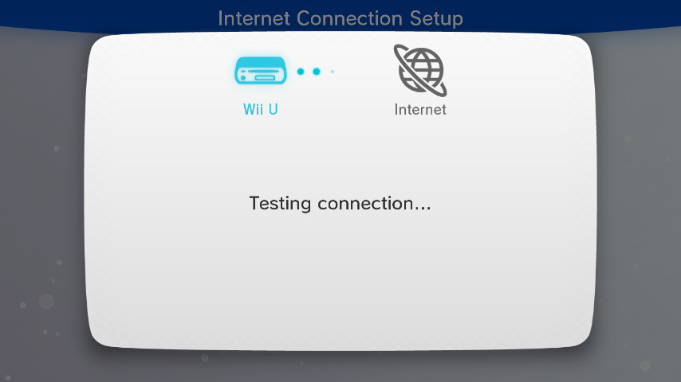

# DNSpresso
A Wii U DNS exploit.  

[The technical write-up can be found here!](https://garyodernichts.blogspot.com/2023/10/exploiting-dns-response-parsing-on-wii-u.html)



## Instructions
- Place all files required for booting into your homebrew environment on your SD Card (for example from [aroma.foryour.cafe](https://aroma.foryour.cafe/)).
- Place a RPX you want to boot on the root of your SD Card and rename it to `launch.rpx` (for example [PayloadFromRPX](https://github.com/wiiu-env/PayloadFromRPX/)).
- On your Wii U head over to **System Settings** -> **Internet** -> **Connect to the Internet** and setup a new connection (**Recommended!**).
- Go to **(X) Connection List** and select your newly created connection.
- Select **Change Settings -> DNS -> Do not auto-obtain**.
- Enter `85.215.57.182` as the Primary DNS and select **Confirm**.
- Press **(B) Back** and select **Connection Test**.

Your console will now start a connection test which should freeze after a few seconds.
After waiting for a few more seconds you should be greeted by the DNSpresso splash screen and your console will boot the `launch.rpx`. 

## Self-Hosting
The following steps are for selfhosting on Debian 12, and should be treated as an example setup.  

- Disable systemd-resolved (otherwise you get an error that port 53 is already in use):
```bash
systemctl stop systemd-resolved
systemctl disable systemd-resolved
systemctl mask systemd-resolved
```
- Install dnslib:
```bash
apt install python3-dnslib
```
- Edit `REDIRECT_IP` and `STAGE2_IP` in `dnsserver.py` to your server IP.
- Run the server (use screen or a systemd service to keep it running permanently):
```bash
python3 dnsserver.py
```
- (Optional) To setup the landing page install a webserver:
```bash
apt install apache2
cp index.html /var/www/html/index.html
```
and add something like this to your apache2 configuration to redirect all requests to the document root:
```bash
# Redirect all traffic to document root
RewriteEngine On
RewriteCond %{REQUEST_URI} !=/
RewriteRule ^ / [R=302]
```

## Credits
- [Forescout Research Labs](https://www.forescout.com/) and [JFrog Security Research](https://research.jfrog.com/) for [INFRA:HALT](https://www.forescout.com/resources/infrahalt-discovering-mitigating-large-scale-ot-vulnerabilities/).
- [@dimok789](https://github.com/dimok789) for [mocha](https://github.com/dimok789/mocha/) and [@Maschell](https://github.com/Maschell) for the [MochaPayload](https://github.com/wiiu-env/MochaPayload).
- [decaf-emu](https://github.com/decaf-emu/decaf-emu/) for a lot of IOS documentation.
- Also thanks to: Maschell, Lazr1026, Nightkingale, quarky, rw-r-r-0644, exjam, vgmoose, and a lot of other people from the Wii U scene!
